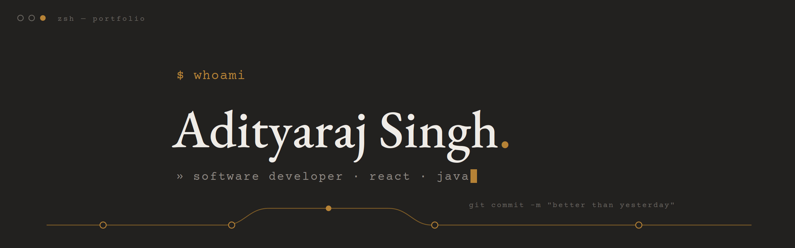

### Hi, I'm Adityaraj 👋

**SDE 1 @ Docprime (Policybazaar Group)** — full-stack engineer building for the **web and mobile**, from pixel to API.

```javascript
const adityaraj = {
  web:      ["React", "TypeScript", "JavaScript", "Redux", "Tailwind CSS"],
  mobile:   ["React Native", "Android", "iOS"],
  backend:  ["Java", ".NET", "REST APIs & wrappers"],
  database: ["MySQL", "MongoDB"],
  motto:    "better than yesterday",
};
```

#### 🚀 What I've been shipping

- 📱 Production features for the **Docprime** healthcare app — React Native + Java, API integrations & performance fixes
- 🏥 Built PB Health's **Self Check-in Kiosk** frontend from scratch and owned the **Inventory Management** module end-to-end — React, TypeScript, Tailwind CSS
- 💼 Full-stack features for **Policybazaar for Business** (Enrollment) — React, Redux, .NET, MySQL
- 🏆 Finalist, **Policybazaar Hackathon 3.0** — PII Interceptor

#### 🛠️ Tech Stack

**Frontend — Web & Mobile**


**Backend & APIs**


**Databases**


**Tools I use daily**


#### 📫 Let's connect

[](https://www.linkedin.com/in/adityarajsinghcode/)
[](https://x.com/adityaRajBuilds)
[](mailto:adityarajsingh.code@gmail.com)

---

`git commit -m "better than yesterday"`
