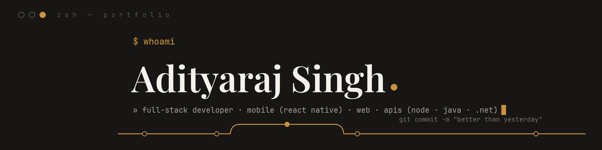

[](https://adityarajsingh-dev.netlify.app)

### Hi, I'm Adityaraj 👋

**SDE 1 @ Docprime (Policybazaar.com)** — full-stack engineer building for **web and mobile**, from pixel to API. React & React Native on the front, Java and .NET REST APIs behind, on a weekly release train.

```javascript
const adityaraj = {
  web:      ["React", "TypeScript", "JavaScript", "Redux Toolkit", "Tailwind CSS"],
  mobile:   ["React Native", "Android", "iOS"],
  backend:  ["Node.js", "Express", "Java", ".NET", "REST APIs & wrappers"],
  database: ["MySQL", "MongoDB"],
  ai:       ["Claude", "Gemini", "RAG", "multi-provider routing", "Claude Code"],
  motto:    "better than yesterday",
};
```

#### 🚀 What I've been shipping

- 📱 Features across **8+ product journeys** in the **Docprime** employee healthcare app — Android + iOS from one React Native codebase, weekly release train
- 🔌 Consolidated **25+ partner integrations** into one common WebView component — plus the Java-side integration wrappers — so every partner flow has a single place to fix
- 🏥 **PB Health** — queue-management system on in-hospital displays (live queue + estimated wait), **live in two hospitals**
- 🖥️ Built PB Health's **Self Check-in Kiosk** from an empty repository — now the primary check-in path in both hospitals
- 📦 Owned the **Inventory Management** frontend end to end — warehouse, store and hospital: orders, transfers, returns, pickups
- 💼 Full-stack **Policybazaar for Business** Enrollment — React, Redux, .NET, MySQL — revenue-critical group-insurance flows still live
- 🤖 Authored a **Claude Code skill** enforcing platform-specific Android/iOS UI handling, plus pre-commit hooks that caught a release-blocking config bug
- 🏆 Finalist, **Policybazaar Hackathon 3.0** — PII Interceptor

#### 🔨 Building in public

- **J.A.R.V.I.S** — local multi-provider AI assistant platform. Three interfaces (web HUD, terminal TUI, ambient mode) on one **zero-dependency Node.js** core. OpenAI-compatible router over three upstreams with priority routing, health polling, automatic failover, SSE streaming and persona-injection middleware. Canvas 3D particle hologram, Hinglish voice input, neural TTS.
- **[StudyNotion v2](https://github.com/adityarajsingh-git/studynotion-v2)** — solo ground-up rebuild of a team-of-four course project. Instructor course builder with draft/publish, lesson CRUD with validated reordering, per-resource ownership checks. **229 automated tests**; ran a security review of my own code and fixed four issues (ReDoS in search, enrolled-student ID leak, defaulting JWT secret, missing rate limiting) — each guarded by a regression test.
- **[DualMind](https://github.com/adityarajsingh-git/dualmind-chatbot)** — dual-mode chatbot (Recruitment Assistant + Employee Help Desk) with a client-side **RAG** pipeline: scored retrieval picks the top-5 knowledge-base entries, then Claude or Gemini answers only from those excerpts, with citations. Bring-your-own-key; falls back to a rule engine on any failure.
- **AI-132 — Jira-to-PR Agent Cockpit** *(internal)* — turns Jira tickets into code via headless Claude Code CLI sessions against local repos, then drives Bitbucket PRs and Jenkins builds from one screen. Designed its multi-root project resolution; extended it to wire a whole journey — backend, frontend, branches — from one task + a Figma link. Controllable from a phone over Telegram.
- **[Portfolio](https://github.com/adityarajsingh-git/portfolio)** — [this site](https://adityarajsingh-dev.netlify.app). AMOLED dark/light themes, scroll-driven CSS 3D, zero libraries.

#### 🛠️ Tech Stack

**Frontend — Web & Mobile**


**Backend & APIs**


**Databases**


**AI & Automation**


**Testing**


**Tools I use daily**


#### 📫 Let's connect

[](https://adityarajsingh-dev.netlify.app)
[](https://www.linkedin.com/in/adityarajsinghcode/)
[](https://x.com/adityaRajBuilds)
[](mailto:adityarajsingh.code@gmail.com)

---

`git commit -m "better than yesterday"`
